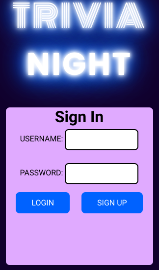
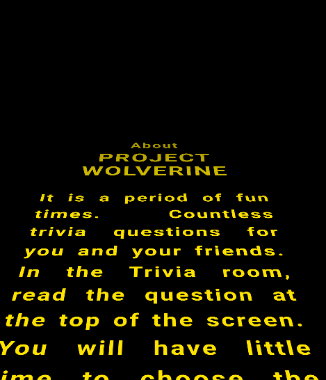
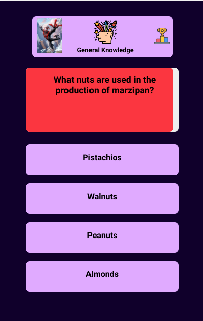
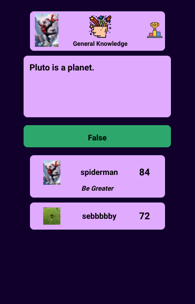
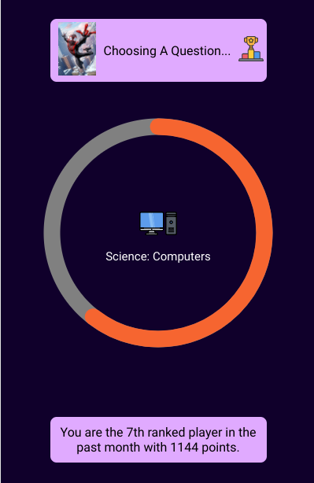
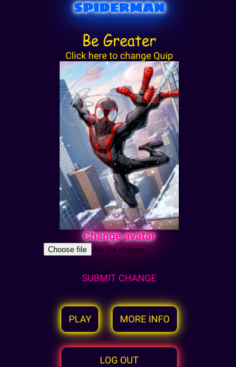

# Triva Night (a.k.a projectWolverine)
This is a trivia app capable of hosting multiple players at a time. It was influenced by the triva games you could play at a bar. You know the one that the one drunk guy plays by himself at the end of the bar while nursing his beer. Yeah that one. We all enjoy playing those games just as much as the lonely guy. Well now you can play from anywhere and with anyone. There are 1000s of questions randomly generated from a wide range of categories. There's even a persistent global leaderboard. You can track your self compared to other players based on the hour, day, week, and more.
---
### Screenshots
  
  

### Technologies Used:
- Django
- Python
- HTML
- CSS
- Javascript
- Progress.js
- Open Trivia Database (api)

### Getting Started
[Link to Trivia Night](http://project-wolverine.herokuapp.com/)  
Press play. Then signup or login if needed. You can tap the more info link if you need some instructions. Otherwise hit play and jump right into the game. Each question has a timer. The faster you answer the more points you will get for answering correctly. If you answer incorrectly, no points for you. after making a selection you'll be put in a waiting room where you can see how you did on the question and how your peers did too! Once the question period is over you'll be taken to the intermission page where the next question will be queued up. When you signup up a profile is created. You can upload an image for your avatar or make a quip for your profile by tapping on the avatar icon in the top left corner. That avatar and quip is visible to players on the waiting screen.

### Next Steps/Icebox Items:
- View stats and/or leaderboard on detail page
- limit file size and type for avatar uploads
- AAU I want to create and/or join a group
- reduce waiting time if no other players are logged in (or make the waiting page more ingaging)
- Implement a trophy system
